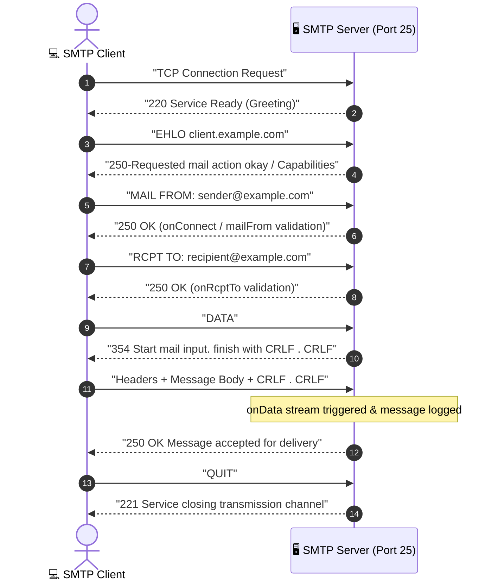

# SMTP Server Learning Context

## Purpose
This repository is a hands-on project for building an email server and gaining a deep understanding of SMTP (Simple Mail Transfer Protocol) and how mail servers operate under the hood. It is not a complete Gmail clone: the current server accepts an SMTP connection and logs the message data, but does not store, route, or display email.

The implementation is in `index.js` and uses the `smtp-server` Node.js package. It currently listens on port 25. Its callbacks show where the connection is accepted (`onConnect`), the envelope sender is checked (`mailFrom`), each recipient is checked (`onRcptTo`), and the message stream is received (`onData`).

---

## DNS & MX Record Lookup

Before an SMTP client can connect to an email server, it must discover where to send the email:

1. The client inspects the recipient's email address domain (e.g., `recipient@example.com`).
2. The client performs a DNS query requesting the **MX (Mail Exchanger) records** for `example.com`.
3. The DNS server returns the primary mail server's domain name (e.g., `mail.example.com`) and its priority preference.
4. The client resolves `mail.example.com` to an IP address via an **A record** (address record) lookup and opens a TCP connection on port 25.

---

## SMTP Delivery Sequence

